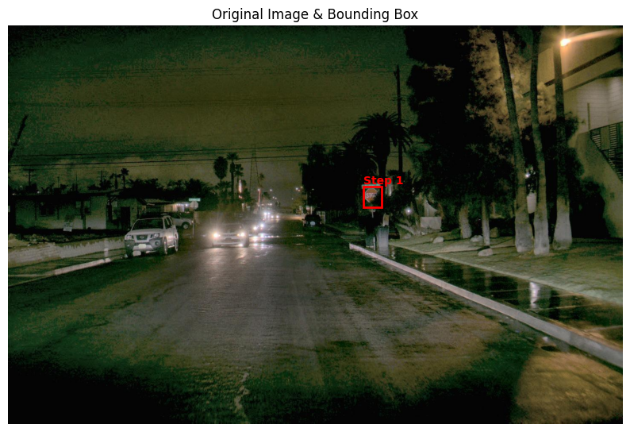
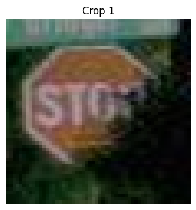

# [CVPR 2026 Highlight] AdaptVision: Efficient Vision-Language Models via Adaptive Visual Acquisition


<a href='https://adaptvision.github.io/'></a>
<a href='https://arxiv.org/abs/2512.03794'></a>
<a href='https://huggingface.co/AdaptVision/models'></a>

## Release
- [x] **[2026.04.09]** AdaptVision has been selected as a CVPR 2026 **Highlight** paper.
- [x] **[2026.02.21]** AdaptVision is accepted by [CVPR 2026](https://cvpr.thecvf.com/).
- [x] **[2025.11.18]** 🔥 AdaptVision is coming! We release the [project page](https://adaptvision.github.io/), [paper](), [code](https://github.com/AdaptVision/AdaptVision) and [models](https://huggingface.co/AdaptVision/models).

## Contents
- [Demo](#inference-demo)
- [Installation](#installation)
- [Train](#train)
- [Evaluation](#evaluation)
- [Citation](#citation)
- [Acknowledgement](#acknowledgement)
- [License](#license)

## Demo

The full runnable notebook is available in [`cookbooks/adaptvision.ipynb`](cookbooks/adaptvision.ipynb).

**Question:** `Is there a stop sign facing us?`

<p align="center">
  
  
</p>
<p align="center">
  <em>Global view -> local zoom -> final answer: Yes, there is a stop sign facing us.</em>
</p>

```python
# Equivalent to the example in cookbooks/adaptvision.ipynb
bot = AdaptVision(model_path="AdaptVision/AdaptVision-7B")
result = bot.run("assets/test_img2.png", "Is there a stop sign facing us?")
show_result(result)
```

```text
--- Round 1 ---
<think>...I need to zoom in on that area.</think>
<tool_call>{"name": "request_local_region", "arguments": {"bbox_2d": [418, 189, 440, 214]}}</tool_call>

--- Round 2 ---
<answer>Yes, there is a stop sign facing us.</answer>
```

AdaptVision first reasons over a downsampled global image, then requests a high-resolution local crop before producing the final answer. This active-vision loop helps preserve efficiency while recovering small but decisive details.

## Installation

The environment follows the [Verl](https://github.com/volcengine/verl).
```
git clone https://github.com/AdaptVision/AdaptVision.git
conda create -n adaptvision python=3.11 -y
conda activate adaptvision
# veRL
pip3 install -e . 
# flash-attn
pip3 install flash-attn==2.7.3 --no-build-isolation

pip install transformers==4.51.0
pip install math_verify
pip install ray[default]
pip install tensordict==0.6.2
pip install qwen_vl_utils
```

## Train
### Data Preparation
```
# train file
huggingface-cli download --repo-type dataset --resume-download Senqiao/VisionThink-Smart-Train --local-dir datasets/VisionThink-Smart-Train

# val file
huggingface-cli download --repo-type dataset --resume-download Senqiao/VisionThink-Smart-Val --local-dir datasets/VisionThink-Smart-Val
```

### Train AdaptVision via Reinforcement Learning

To use GPT as the reward model, first set the following environment variables:

```
AZURE_API_KEY=
AZURE_ENDPOINT=
AZURE_API_VERSION=
```

Run AdaptVision Training:

```
bash scripts/run_adaptvision.sh
```


## Evaluation

We use [lmms-eval](https://github.com/EvolvingLMMs-Lab/lmms-eval) to evaluate our model. Setup the evaulation environment by following instructions [here](https://github.com/EvolvingLMMs-Lab/lmms-eval).

We provide the evaluation code detail in [`scripts/vllm_adaptvision.py`](scripts/vllm_adaptvision.py).

## Citation

If you find this project useful in your research, please consider citing:

```bibtex
@article{lin2025adaptvision,
  title={AdaptVision: Efficient Vision-Language Models via Adaptive Visual Acquisition},
  author={Lin, Zichuan and Liu, Yicheng and Yang, Yang and Tao, Lvfang and Ye, Deheng},
  journal={arXiv preprint arXiv:2512.03794},
  year={2025}
}
```


## Acknowledgement
We would like to thank the following repos for their great work:

- This work is built upon the [verl](https://github.com/volcengine/verl), [lmms-eval](https://github.com/EvolvingLMMs-Lab/lmms-eval), and [VisionThink](https://github.com/dvlab-research/VisionThink).
- This work utilizes models from [Qwen](https://huggingface.co/Qwen/Qwen2.5-VL-7B-Instruct), and data from [VisionThink](https://huggingface.co/datasets/Senqiao/VisionThink-Smart-Train).


## License
- AdaptVision is licensed under the Apache License 2.0. 
